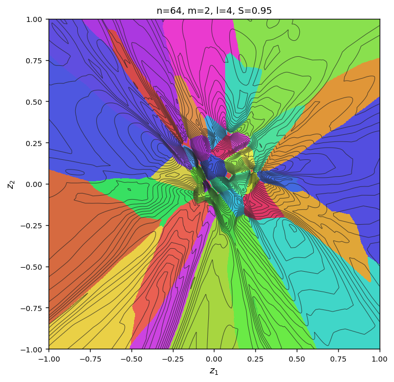
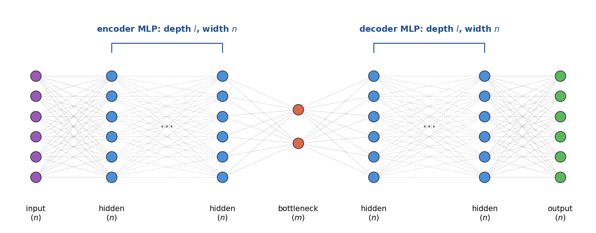
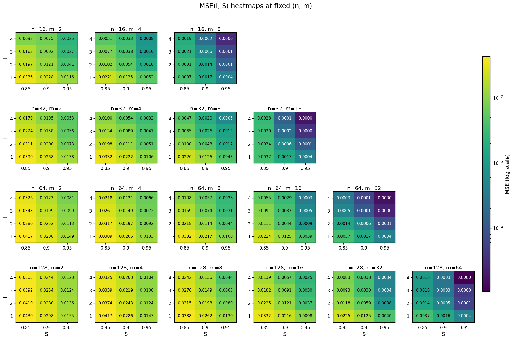
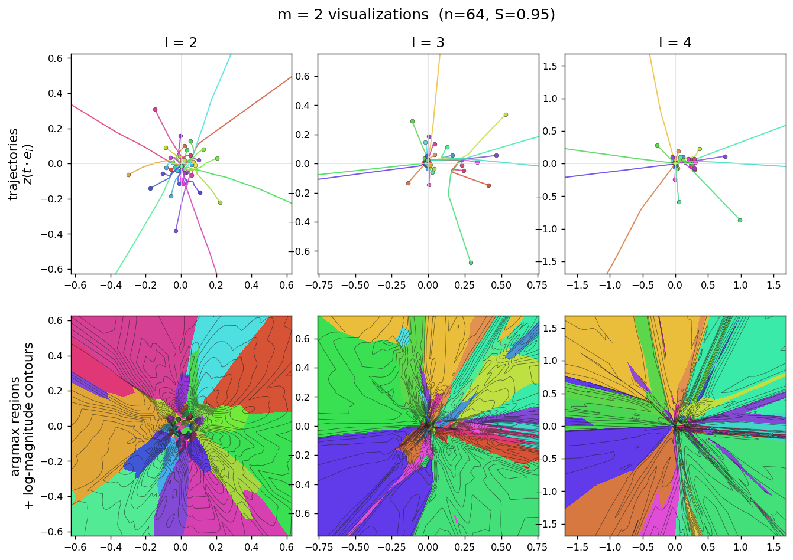
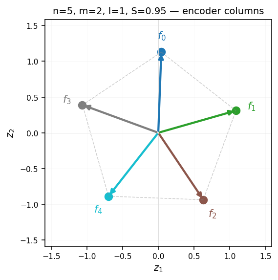

# A Toy Model of Nonlinear Features

These are some preliminary results based on follow-up work to [*Toy Models of Superposition*](https://transformer-circuits.pub/2022/toy_model/index.html) (Elhage et al., Anthropic). The autoencoder in that paper used a single linear layer for the encoder and a single linear layer for the decoder, so the latent representation was a linear function of the input by construction. This project relaxes that condition and sweeps autoencoders trained on sparse non-negative data across `(n, m, l, S)` — input dim × bottleneck dim × depth × sparsity. Each config is optimized to (or near) its minimum and a scaling law is fit over the resulting reconstruction losses. For m = 2 the bottleneck layer is directly plottable, exposing the nonlinear encodings. The l = 1 (tied-linear) slice of the sweep reproduces the iconic pentagon arrangement from *Toy Models of Superposition*. Connections to other recent work on nonlinear features are discussed at the end.



*A visualization of the bottleneck layer for a particularly high level of compression (64 features into a 2-dimensional bottleneck layer). We color the (z₁, z₂) plane by `argmax_i decode(z)[i]` for a trained autoencoder at n = 64, m = 2, l = 4, S = 0.95. Each color represents the feature the decoder picks as most active at that point. Contour lines are log decoder-output magnitude (denser near origin where ReLU pre-activations are flipping; spaced regularly far out where decode is approximately linear).*

## Setup



*We train autoencoders with the above simple architecture. The encoder and decoder are both an MLP with width n, and depth l. The bottleneck layer is width m. Sparsity S means all features have probability S to be 0 and probability (1 − S) to be uniform [0, 1].*

## Scaling law

```
log10(MSE) ≈ −1.37 · log(m/n)  +  1.87 · log(1−S)  −  0.17 · l  −  1.08        (R² = 0.79)
```

The above scaling law fits the MSE with an R-squared of 0.79. It is of course possible to achieve a better fit if we sacrifice elegance/transparency and use black-box methods.



*Rows: input dim n. Columns: bottleneck m. Inner panel: y = depth l, x = sparsity S. Color (and printed number) is MSE on a log scale. Missing panels are configs where m ≥ n (not in the sweep).*

## m = 2 visualizations

At m = 2 the bottleneck layer is directly plottable. For each (n, l, S) we look at two panels:

- **Trajectories** `z(t·e_i)` for t ∈ [0, 1] across all feature axes. This plots how a feature moves in the bottleneck layer when all other features are zero and the feature is gradually turned from zero to one. The nonlinearity of the encoder allows the trajectories to bend but also allows the trajectories to move at different "speeds" away from the origin which enables magnitude superposition.
- **Argmax regions** — the (z₁, z₂) plane colored by which feature the decoder picks as largest. Colors match the trajectory colors, so feature *i* is the same color in both panels.



### Replicating the Toy Models pentagon

Restricting to the l = 1 (tied-linear) slice of the sweep makes our setup essentially the *Toy Models of Superposition* setup. For n = 5, m = 2, S = 0.95 we can produce the pentagon result:



*Encoder columns of the trained l = 1 autoencoder. Model saved at `exploratory/seed_models/pentagon_n5_m2_l1_S0.95.pt`.*

Full geometry across all (n, l, S) is in `notebooks/m2_geometry.ipynb`.

## Side note: ReLU autoencoders without biases collapse to linear

A bias-free ReLU encoder collapses to a linear encoder: `f(t·x) = t · f(x)` for t ≥ 0. Since the input data is non-negative, every ReLU is always in its positive, purely linear region. That forces every `z(t·e_i)` trajectory to be an exact straight ray through the origin.

## Optimization note: monotonicity constraints

The MSE should be monotonic on all four axes. Making the model wider, the input narrower, the data sparser, or the architecture deeper all make the optimization problem strictly easier, so any violation is an optimization failure.

## Related work

- **Elhage, Hume, Olsson et al., *Toy Models of Superposition*** ([transformer-circuits.pub](https://transformer-circuits.pub/2022/toy_model/index.html)). The paper this project directly builds on. Their architecture (linear encoder + linear decoder + output ReLU) constrains the latent to be a linear function of the input.
- **Csordás, Potts, Manning, Geiger, *Recurrent Neural Networks Learn to Store and Generate Sequences using Non-Linear Representations*** ([arXiv:2408.10920](https://arxiv.org/abs/2408.10920)). This paper argues RNNs use genuinely nonlinear representations.
- **Liv Gorton, *What Would Non-Linear Features Actually Look Like?*** ([livgorton.com](https://livgorton.com/non-linear-feature-reps/)). This post argues why linear features are natural.
- **Gurnee, Ameisen, Kauvar, Tarng, Pearce, Olah, Batson, *When Models Manipulate Manifolds: The Geometry of a Counting Task*** ([transformer-circuits.pub](https://transformer-circuits.pub/2025/linebreaks/index.html)). This paper does feature-manifold analysis in a real model. The nonlinearity is more a structure of the data than of the model's compression per se.
- **Bhalla, Geiger, Fel, Lubana et al., *Can SAEs Capture Neural Geometry?*** ([goodfire.ai](https://www.goodfire.ai/research/can-saes-capture-neural-geometry)). These authors ask whether linear-SAE decoders miss curved structure. Again, here the nonlinearity seems to be more a structure of the data than of the model's compression.
- **Luo, Feng, Darrell, Radford, Steinhardt, *Learning a Generative Meta-Model of LLM Activations*** ([arXiv:2602.06964](https://arxiv.org/abs/2602.06964)). This paper fits a diffusion meta-model to LLM activations, generating nonlinear equivalents of SAE latents.
- **Shafran, Ronen, Fahn, Ravfogel, Geiger, Geva, *From Directions to Regions: Decomposing Activations in Language Models via Local Geometry (MFA)*** ([arXiv:2602.02464](https://arxiv.org/abs/2602.02464)). This work also suggests a nonlinear decomposition method but uses MFA as opposed to diffusion.
